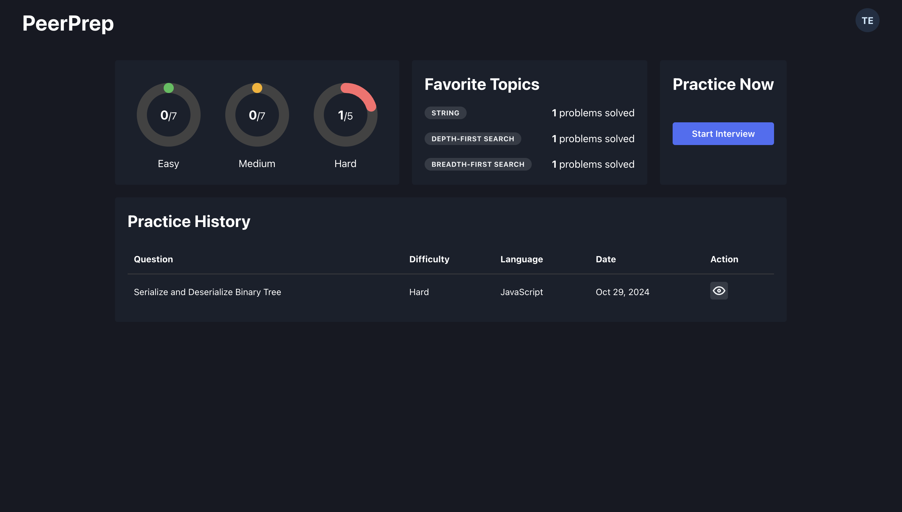

[](https://classroom.github.com/a/bzPrOe11)

# PeerPrep



## Overview

[**PeerPrep**](https://peerprep.zoeang.dev/) is designed for programmers to practice and ace technical interviews by matching with others to practice LeetCode questions.

Some of PeerPrep's features include:

- :white_check_mark: Partner matching based on chosen question topic and difficulty
- :pencil: Collaborative coding pad to simulate technical interviews
- :telephone_receiver: Video call to communicate with your partner
- :notebook: History of practice attempts for revision

Start using [**PeerPrep**](https://peerprep.zoeang.dev/) now!

## Team

Members of CS3219 Project Group 39:

- Ho Jun Hao
- Jerald Kiew
- Zoe Ang
- Li Yingming
- Jason Qiu

## Contributing

Feel free to check out our [technical report](docs/technical-report.pdf) for this project!

### Installation

1. Clone this repository.

```bash
git clone https://github.com/CS3219-AY2425S1/cs3219-ay2425s1-project-g39.git
cd cs3219-ay2425s1-project-g39
```

2. Add environment variables.

Add the provided secret .env folder in the root directory `cs3219-ay2425s1-project-g39`

3. Run the docker containers.

```bash
docker compose up -d
```

Congratulations! You have successfully set up PeerPrep. :tada:

4. Stop and remove the docker containers and images.

```bash
docker compose up --rmi "all"
```
